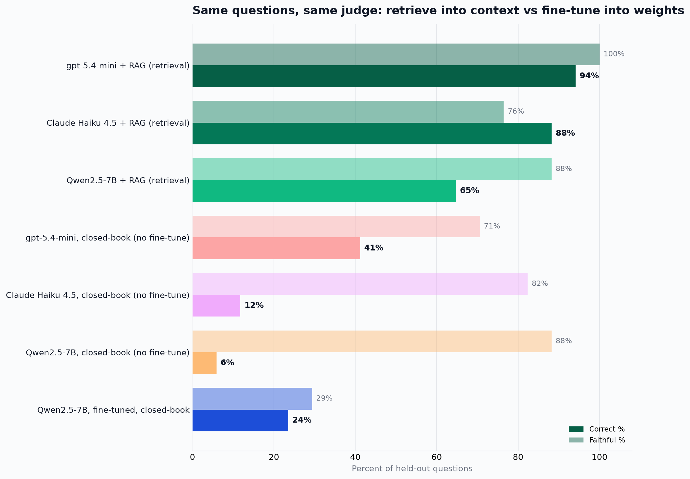

# rag-vs-finetune

A measured head-to-head: if you need a model to answer questions about your financial documents, is it better to put that knowledge into the model's **weights** (fine-tune) or into its **prompt** (RAG)? Same questions, same judge, every condition.

This is the experiment behind the write-up. The retrieval pipelines it compares against come from the [rag-bake-off](https://github.com/bha6kar/rag-bake-off) study; the slice of that data this experiment needs (questions, the tuned RAG scored runs, the chunk stores) is vendored under `bakeoff/`, so this repo runs on its own.

## Result (17 held-out finance questions, judged by gpt-5.4-mini)



| Condition | Correct | Faithful |
|---|---|---|
| gpt-5.4-mini + RAG | 94% | 100% |
| Claude Haiku 4.5 + RAG | 88% | 76% |
| Qwen2.5-7B + RAG | 65% | 88% |
| gpt-5.4-mini, closed-book | 41% | 71% |
| Claude Haiku 4.5, closed-book | 12% | 82% |
| Qwen2.5-7B, closed-book | 6% | 88% |
| Qwen2.5-7B, fine-tuned, closed-book | 24% | 29% |

Read-out:

- RAG lifts every model on the same retrieved context: gpt-5.4-mini 41 to 94, Claude 12 to 88, and the open Qwen2.5-7B 6 to 65. The knowledge was never in the weights; it was in the documents.
- Fine-tuning the open model closed-book on the documents **could not close the gap**: even given a fair shot (513 question/answer pairs drawn from the same document chunks RAG retrieves from, trained to learn rather than memorise), it reached only 24% correct while its faithfulness collapsed from 88% to 29%, fabricating confidently on held-out questions. That is the failure Gekhman et al. (arxiv 2405.05904) describe. The same model with RAG: 65%.
- There is no fine-tuned-Claude row because Anthropic does not offer fine-tuning of Claude. For Claude, RAG is the only knowledge lever.

The fine-tune got a genuine, well-resourced attempt and still lost to retrieval by a wide margin on the same model. Fine-tune for behaviour and format; retrieve for what the model needs to know.

## What it does

The fine-tune trains the open model closed-book (question to ground-truth answer, no context) on 513 question/answer pairs generated from the document chunks (see `make_synthetic_data.py`), then scores the 17 held-out questions across seven conditions, all graded by the same gpt-5.4-mini judge on correctness and faithfulness. RAG uses the same retrieved context the bake-off's tuned pipeline used, so any model's RAG condition is directly comparable, and both fine-tuning and RAG draw on the same document content. The open model is Qwen2.5-7B-Instruct, run locally (LoRA fine-tune and inference) via MLX on Apple Silicon; the hosted models go through Azure OpenAI (judge and gpt-5.4-mini) and OpenRouter (Claude).

## Files

- `config.py` base models, deployment, paths, closed-book prompt
- `load_questions.py` load all 54 questions from the vendored `bakeoff/`
- `build_data.py` stratified train/test split (defines the held-out 17)
- `make_synthetic_data.py` generate the 513-pair training corpus from document chunks (Azure)
- `train_local.py` local LoRA fine-tune via MLX (Apple Silicon)
- `azure_client.py` Azure OpenAI client (endpoint/key from `~/.secrets`)
- `eval_all.py` score conditions (rag, base/ft local, base/ft azure)
- `claude_conditions.py` Claude closed-book + Claude+RAG via OpenRouter
- `make_report.py` render `work/report.md` and `images/experiment_results.png`
- `bakeoff/` vendored slice of the bake-off (questions, tuned runs, chunk stores)
- `work/` splits, results.json, report.md

## Run order

```bash
uv sync
uv run python build_data.py
uv run python make_synthetic_data.py     # 513 grounded Q/A from the chunks
uv run python train_local.py             # LoRA fine-tune on that corpus
uv run python eval_all.py --conditions rag,base_azure,base_local,local_rag,ft_local
uv run python claude_conditions.py
uv run python make_report.py
```

Hosted calls expect Azure OpenAI (`AZURE_OPENAI_ENDPOINT`/`AZURE_OPENAI_API_KEY`, deployment `gpt-5.4-mini`) and an OpenRouter key at `~/.secrets/openrouter_api_key`. The local fine-tune needs Apple Silicon (MLX).
