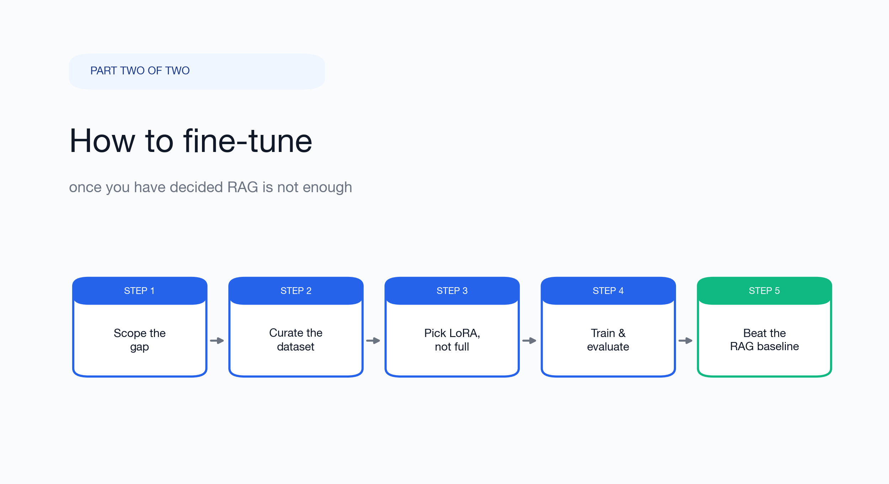
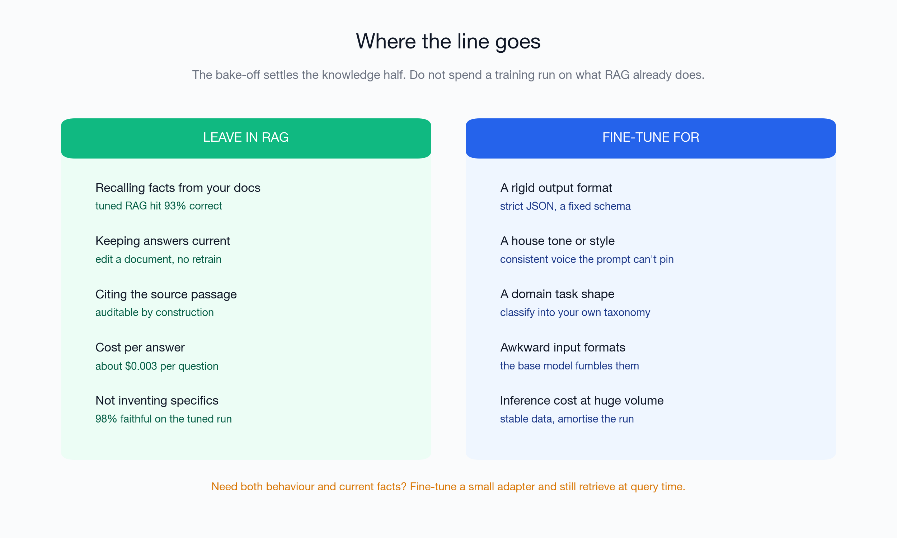
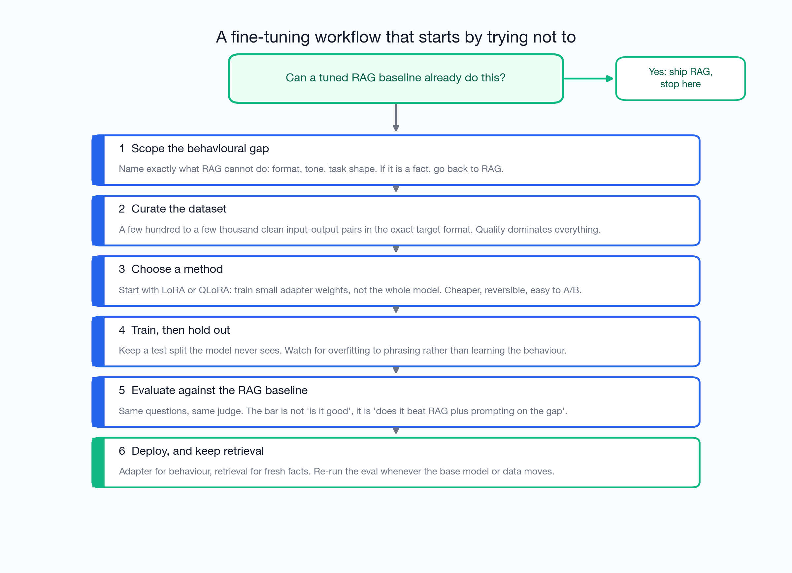
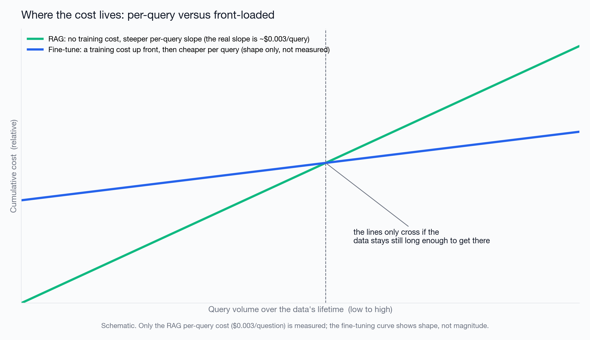
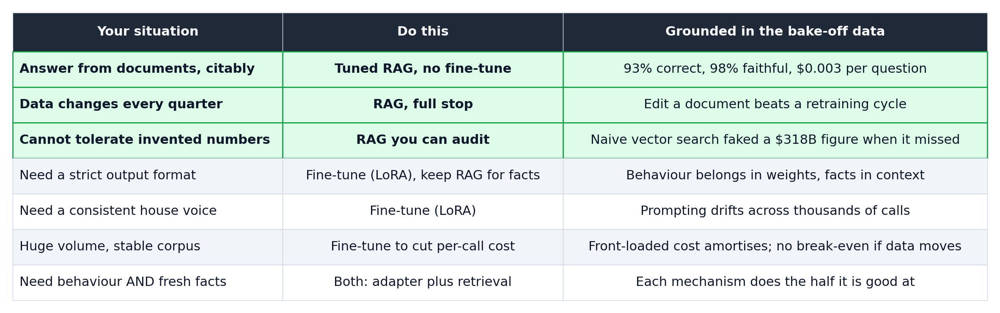

# How to fine-tune, once you have admitted RAG is doing most of the work

*Part two of two. In part one I measured ten RAG pipelines on real financial filings and found that a tuned retrieval baseline answers correctly 93% of the time at about three tenths of a cent per question. This piece is the other door: how to fine-tune properly, when to bother, and how to use those same RAG numbers as the bar your fine-tune has to clear.*

---

## Start from the result that should make you hesitant

In the first article I ran a fairly exhaustive retrieval benchmark: ten pipelines, 54 hand-checked questions, four real SEC filings (Apple, Berkshire, AMD, Boeing), an LLM judge on two criteria, and a per-question cost breakdown. The single most useful number that came out of it:

**A tuned vector-RAG baseline hit 93% accuracy and 98% faithfulness at roughly $0.003 per question, with no training of any kind.**

I am opening the fine-tuning guide with that on purpose. The most common fine-tuning mistake is not a bad learning rate or a wrong rank. It is fine-tuning at all, to solve a problem that retrieval already solves for a fraction of a cent. Before you curate a single training example, you should be able to say, out loud, what your fine-tune will do that a tuned RAG baseline plus a good prompt cannot.

One honesty note that carries over from part one: I benchmarked the RAG side, I did not benchmark a fine-tune on these documents. So the RAG figures below are measured; the fine-tuning guidance is drawn from established practice and the research literature. I flag which is which throughout. I would rather hand you an honest method than a fake leaderboard.

---

## First, decide whether you should be here at all

Fine-tuning and RAG change different things. RAG changes the prompt: it puts external, current knowledge in the context window at query time. Fine-tuning changes the weights: it bakes behaviour, format, and task shape into the model itself. That distinction is the whole decision.

Here is the line I draw, with the left column grounded in the bake-off numbers:

**Leave it in RAG if the requirement is knowledge.** If the thing you want is "answer correctly from our documents, stay current, and cite the source," retrieval is purpose-built for it and the measured numbers are hard to argue with: 93% correct, 98% faithful, $0.003 a question (query-time only; see the cost note below), and you update an answer by editing a document rather than launching a training run. Trying to push that same factual recall into the weights is the classic trap. Two findings in the literature make the point directly. Ovadia and colleagues compared knowledge injection by fine-tuning against retrieval and found RAG consistently outperformed unsupervised fine-tuning, including on knowledge the model had never seen [1]. Gekhman and colleagues went further: as a model finally does learn new facts through fine-tuning, its tendency to hallucinate rises roughly linearly [2]. So if your real need is "quote the exact figure from the 2024 report," do not fine-tune it in. Retrieve it.

**Come through this door only when the gap is behavioural.** Fine-tuning earns its keep when prompting alone cannot reliably pin down:

- a rigid output format (strict JSON against a schema, a fixed report layout),
- a house tone or voice that must be consistent across thousands of calls,
- a domain task shape (classify into your own taxonomy, follow conventions a base model does not know),
- an awkward input format the base model keeps fumbling,
- or inference cost at very high volume over data that barely changes, where amortising one training run beats paying for retrieved context on every call.

If you cannot put your need in that second list, the rest of this article is optional. That is not a rhetorical flourish. It is the recommendation.

---

## The workflow, and why it opens with a gate

### Step 0: the gate. Can a tuned RAG baseline already do this?

Build the cheap retrieval baseline first, even if you are convinced you need to fine-tune. In part one the upgrade from naive to tuned RAG (recursive splitting, smaller chunks, a larger embedding model, a higher top-K) bought fifteen percentage points of accuracy at the *same* per-query cost, and it took an afternoon, not a training run. Run your real questions through it. If it clears your bar, ship it and stop. You will have saved yourself a dataset, a training pipeline, and a permanent retraining obligation. If it does not clear the bar, you now have something more valuable than a hunch: a measured baseline that your fine-tune has to beat.

### Step 1: scope the behavioural gap precisely

Write down the exact thing RAG plus prompting cannot do. "It is not accurate enough" is not a scope; that is usually a retrieval problem in disguise, and you fix it with better chunking, not training. "It will not hold our JSON schema under adversarial inputs" is a scope. "It will not keep our compliance tone when the user is rude" is a scope. If, when you write it down, the gap turns out to be a missing fact, go back to the gate. Facts are retrieval's job.

### Step 2: curate the dataset, and treat it as the whole game

This is where fine-tunes are won or lost, and it is the cost the feature-table comparisons never price in. You need clean input-output pairs in the exact format you want at inference, typically a few hundred to a few thousand of them. Quality dominates quantity by a wide margin: a few hundred examples that are perfectly consistent in tone and format beat thousands that wobble. Practical guidance from the field:

- Make every output an exemplar. The model copies your dataset's worst habits as faithfully as its best ones.
- Cover the edge cases you actually care about, including the inputs that currently break.
- Hold out a real test split before you train, questions the model will never see during training.
- Keep your RAG eval questions in that test set, so you are measuring the fine-tune against the same bar from part one.

### Step 3: choose a method, and default to small

Start with a parameter-efficient method: LoRA [3], or QLoRA [4] if you are memory-constrained. Instead of retraining the whole model you train a small set of adapter weights. LoRA reports cutting trainable parameters by orders of magnitude versus full fine-tuning; QLoRA pushes the memory footprint down far enough to fine-tune large models on a single GPU. It is dramatically cheaper than full fine-tuning, it is reversible, you can keep several adapters around and A/B them, and it is usually enough for behavioural goals like format and tone. Reach for full fine-tuning only when a well-run LoRA has demonstrably hit a ceiling, which for most format-and-tone problems it will not. If you are using a hosted fine-tuning API, you are almost certainly getting an adapter-style tune under the hood anyway; the same "start small, measure, only scale if needed" discipline applies.

### Step 4: train, then watch for the failure that looks like success

Train, then evaluate on the held-out split, never on the training data. The failure mode to watch for is overfitting to phrasing: the model learns to parrot the surface form of your examples rather than the underlying behaviour, and it looks great on anything close to the training distribution and falls apart on everything else. Lower the number of epochs, add variety to the dataset, and trust the held-out numbers over the training-loss curve.

### Step 5: evaluate against the RAG baseline, not against nothing

This is the step people skip, and it is the reason so many fine-tunes ship without ever earning their cost. The bar is not "is the fine-tuned model good." The bar is "does it beat the tuned RAG baseline plus prompting, on the specific gap I scoped in step 1." Use the same questions and the same judge you used for retrieval. If the fine-tune does not clearly win on the gap, you have built an expensive, harder-to-update model that a prompt was already handling. Roll back to RAG.

### Step 6: deploy, and keep retrieval anyway

For most real systems the answer is not the fine-tuned model instead of RAG. It is the fine-tuned model plus RAG: the adapter supplies the behaviour, retrieval supplies the current, citable facts. Then re-run the part-one eval on a schedule, because the moment your base model version or your underlying data moves, a fine-tune is stale and a document store is not.

---

## Where the cost actually lives

People say "RAG is cheaper" and "fine-tuning is cheaper" and both camps are sometimes right, because they are measuring different things. The honest framing is not which is cheaper but where the cost sits.

RAG's cost is per query and, as part one measured, it can be a fraction of a cent each, with no training bill. Fine-tuning front-loads the cost into a training run and the dataset work behind it, then gives you cheaper inference afterward because you are not paying for retrieved context on every call. Whichever wins on total spend depends entirely on two variables: your query volume and how often your data changes.

To be explicit about the chart above: the RAG slope is the real $0.003-per-query number from the benchmark. The training cost and the cheaper-inference slope for fine-tuning are illustrative, drawn to show the *shape*, not measured on these documents. The shape is the point. High volume over stable data bends toward the fine-tuning economics. Lower volume over fast-moving data bends toward RAG, and the break-even only exists at all if your data sits still long enough to reach it. For a quarterly-updated filing, it never does.

One honest footnote on the RAG side, so nobody accuses the comparison of being rigged: $0.003 is the per-query model cost, query time only. It excludes RAG's own infrastructure, the one-time index build, plus ongoing vector-store hosting and the embedding pipeline. Those are real and they recur, but for the document sizes here they are small and fixed, and they do not move the order-of-magnitude conclusion. Fine-tuning has the mirror-image hidden cost, the dataset, which is usually the larger of the two.

---

## A recommendation table, built from the bake-off

Pulling the part-one results forward as decision rules:

The through-line: the retrieval study already settles the knowledge half at a price that is hard to beat. Fine-tune for the behaviour it cannot give you, measure against it honestly, and keep it in the loop even after you have fine-tuned.

---

## What this guide is and isn't

- The RAG numbers are measured: 54 questions, four finance documents, all SEC filings. A different corpus could move them.
- I did fine-tune a model on these documents (see the appendix), and even given a fair shot (513 Q/A pairs drawn from the documents, trained to learn not memorise) it reached only 24% correct on held-out questions while faithfulness collapsed from 88% to 29%, against 65% for the same model with RAG. That is a fair test of "fine-tune to memorise documents", and a deliberately hard one. It is not a test of fine-tuning for behaviour and format, the thing this guide actually recommends fine-tuning for, which I expect a fine-tune to win and did not benchmark here.
- The strongest production systems I know of use both, and most of the "RAG versus fine-tuning" framing dissolves the moment you treat them as two tools for two different jobs.

If you only keep one rule from both articles: build the cheap retrieval baseline first, make your fine-tune beat it on a gap you can name, and never fine-tune in a fact you could have retrieved.

---

## Appendix: I ran the fine-tune, and it failed exactly as predicted

Talk is cheap, so I fine-tuned a model on the documents and scored it against RAG on the same held-out questions, and I gave the fine-tune a fair shot. I held out 17 of the 54 finance questions for the test, then generated 513 question/answer pairs from the same document chunks RAG retrieves from and fine-tuned an open model (Qwen2.5-7B, a LoRA adapter trained locally on a MacBook Pro via MLX) closed-book on them: question in, ground-truth answer out, no retrieved context, pushing the document knowledge into the weights. Then I scored the held-out 17, every condition graded by the same gpt-5.4-mini judge on correct and faithful.

| Condition | Correct | Faithful |
|---|---|---|
| gpt-5.4-mini + RAG | 94% | 100% |
| Claude Haiku 4.5 + RAG | 88% | 76% |
| Qwen2.5-7B + RAG | 65% | 88% |
| gpt-5.4-mini, closed-book | 41% | 71% |
| Claude Haiku 4.5, closed-book | 12% | 82% |
| Qwen2.5-7B, closed-book | 6% | 88% |
| Qwen2.5-7B, fine-tuned, closed-book | 24% | 29% |

Look at the open model, Qwen2.5-7B, as a same-base trio. Closed-book it scores 6%. Give it the retrieved context and it jumps to 65%. Fine-tune the documents into its weights and it lands at 24% correct while its faithfulness falls off a cliff, from 88% to 29%. And this is the *generous* version: trained on 513 grounded Q/A at a low learning rate, training loss settled at 0.28, so it genuinely learned the material rather than rote-memorising it, and it still produced confident document-shaped fabrications on questions it had not seen. That is the Gekhman et al. result [2] reproduced on a laptop: fine-tune facts in and you buy more hallucination. Thirteen times the training data over my first attempt moved correctness six points and did nothing for faithfulness. Retrieval, meanwhile, lifts every model on the same context: gpt-5.4-mini to 94%, Claude to 88%, Qwen-7B to 65%.

This is the strongest argument for everything above. I fine-tuned for the wrong thing, knowledge, gave it a real corpus, and it still lost badly. That is not an indictment of fine-tuning; it is an indictment of fine-tuning facts you could have retrieved. Fine-tune for behaviour and format, the cases in step 1, and keep retrieval for the knowledge.

Two honest limits. The local fine-tune ran on Qwen2.5-7B, not gpt-5.4-mini, so the fine-tune-versus-frontier rows are not same-base; but the Qwen-7B trio above (closed-book, RAG, fine-tuned) is same-base and shows the effect cleanly. And a much larger corpus, or instruction-tuned abstention examples, might claw back some faithfulness; what it will not do is beat simply retrieving the passage, which already works. And there is no fine-tuned-Claude row because Anthropic does not offer fine-tuning of Claude, which is its own lesson: for Claude, RAG is the only knowledge lever there is. The scripts, splits, and the full per-question results live in the [rag-vs-finetune repository](https://github.com/bha6kar/rag-vs-finetune).

---

## References

1. Ovadia, Brief, Mishaeli, Elisha. "Fine-Tuning or Retrieval? Comparing Knowledge Injection in LLMs." EMNLP 2023. [arxiv 2312.05934](https://arxiv.org/abs/2312.05934)
2. Gekhman, Yona, Aharoni, Eyal, Feder, Reichart, Herzig. "Does Fine-Tuning LLMs on New Knowledge Encourage Hallucinations?" EMNLP 2024. [arxiv 2405.05904](https://arxiv.org/abs/2405.05904)
3. Hu, Shen, Wallis, et al. "LoRA: Low-Rank Adaptation of Large Language Models." 2021. [arxiv 2106.09685](https://arxiv.org/abs/2106.09685)
4. Dettmers, Lewis, Belkada, Zettlemoyer. "QLoRA: Efficient Finetuning of Quantized LLMs." 2023. [arxiv 2305.14314](https://arxiv.org/abs/2305.14314)

---

*Part one, the ten-pipeline RAG bake-off with the full per-question breakdown, code, and judge prompts, lives in the accompanying repository. This follow-up reuses those measured numbers for the retrieval side and adds a measured fine-tuning head-to-head; the published research cited above predicted the result.*

*The fine-tuning head-to-head (scripts, splits, results) is at [github.com/bha6kar/rag-vs-finetune](https://github.com/bha6kar/rag-vs-finetune); the part-one RAG bake-off is at [github.com/bha6kar/rag-bake-off](https://github.com/bha6kar/rag-bake-off). More of my work at **[thejarvis.dev](https://thejarvis.dev)**.*
