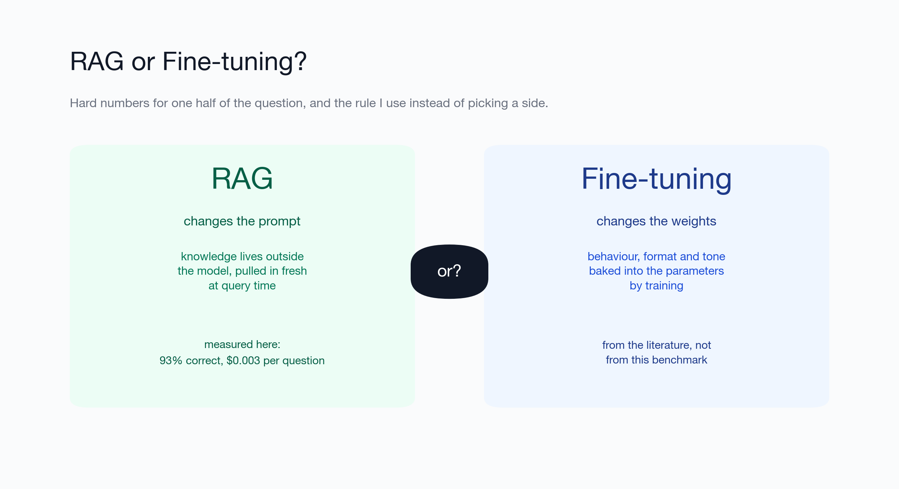
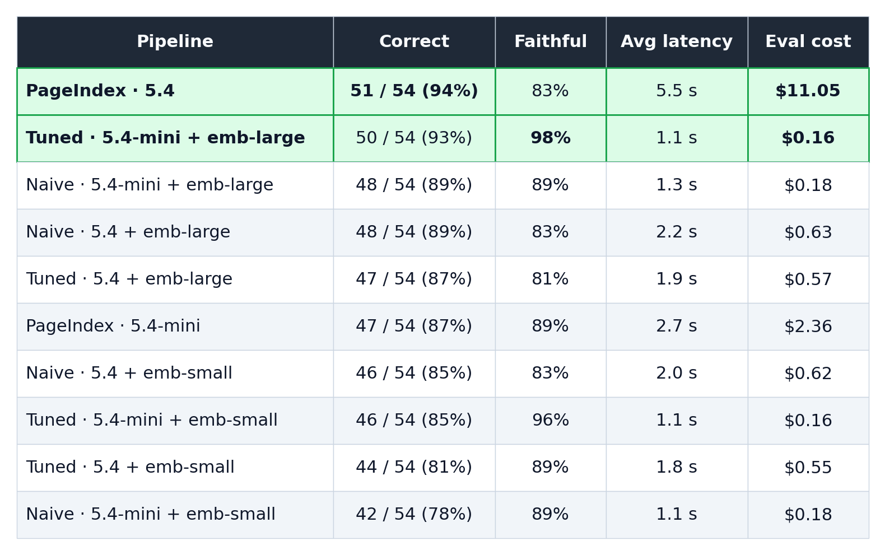
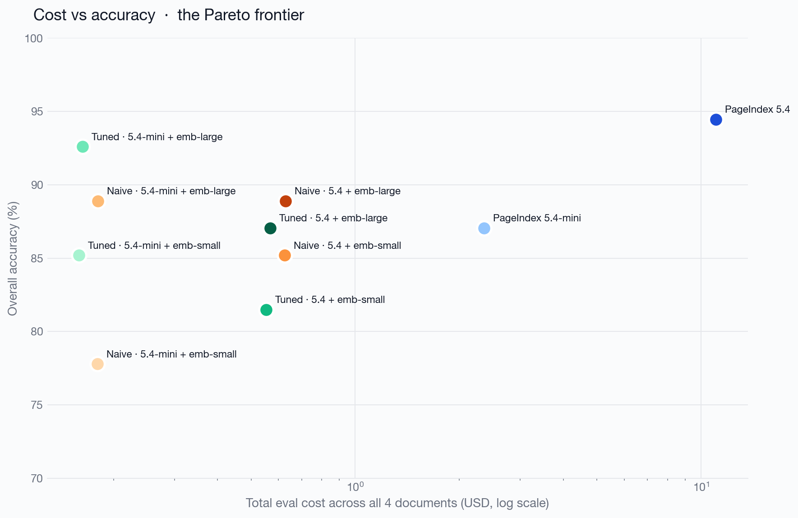

# RAG or fine-tuning? I measured both on the same documents, and the gap is bigger than the debate admits.

*Everyone frames this as a versus. I built both: a RAG pipeline and a fine-tune, scored on the same held-out finance questions by the same judge. RAG took gpt-5.4-mini from 41% to 94% correct, and lifted an open model from 6% to 65%. Then I gave fine-tuning a fair shot, training that same open model on 513 question/answer pairs drawn from the documents, and it still reached only 24% closed-book while its faithfulness collapsed from 88% to 29%. Here is the data, what fine-tuning is actually good at, and the decision rule I now use.*

---

## The question that won't go away

If you are building anything that answers questions over your own data, someone has asked you the same thing: "should we fine-tune a model on this, or just do RAG?"

It gets framed as a fork in the road. Two doors, pick one. Most of the content online treats it that way too: a feature table, a row for "cost", a row for "freshness", a tick in one column, and a verdict.

I think that framing is wrong, and I think it survives because almost nobody has actually measured the retrieval side end to end. People have a vague sense that "RAG is cheaper" and "fine-tuning is more accurate", and then they argue from the vibe.

I recently ran a fairly involved retrieval benchmark: ten different RAG pipelines, 54 hand-checked questions, four real SEC filings, an LLM judge, and a per-question cost and latency breakdown. Then I did the thing most of these articles skip: I fine-tuned a model on the same documents and scored it head to head against RAG, same questions, same judge. So this is not vibes on either side.

One honesty note up front, because it shapes how you should read the numbers. The fine-tune I ran tests fine-tuning at *knowledge injection*, getting facts out of documents, which is precisely the job the literature says fine-tuning is worst at. It is not a test of fine-tuning for *behaviour and format*, which is the job fine-tuning is genuinely good at and which RAG cannot do at all. So read the headline result as "do not fine-tune to memorise your documents", not "never fine-tune". The behavioural case, which I did not benchmark, gets its own honest treatment further down.

---

## What each one actually does

Strip away the marketing and the two approaches are doing genuinely different jobs.

**Fine-tuning changes the model's weights.** You take a base model and continue training it on your examples, so the behaviour you want gets baked into the parameters. The knowledge, or more often the *style and format and task shape*, lives inside the model after training. At inference time you send a prompt and the model responds from what it learned. Nothing external is consulted.

**RAG changes the model's prompt.** You leave the model alone. At query time you search an external store for the passages most relevant to the question, paste them into the context window, and ask the model to answer using that text. The knowledge lives outside the model, in your documents, and gets pulled in fresh on every call.

That single distinction, weights versus context, drives almost every practical difference that follows. Fine-tuning is teaching. RAG is giving the model an open book and asking it to read the right page.

The reason "versus" is the wrong word: these change different things and compose cleanly. You can fine-tune a model to follow your house answer format and *also* hand it retrieved context at query time. Plenty of strong production systems do exactly that. Hold that thought. It matters for the verdict.

---

## The RAG side, with the numbers I actually have

Here is the part I can speak to with evidence. I built a question-answering system over four finance documents: Apple's FY2024 10-K, Berkshire Hathaway's 2024 annual report, and AMD's and Boeing's 2022 10-Ks from the published FinanceBench benchmark. I wrote 40 questions by hand for Apple and Berkshire across three buckets (single-fact lookup, multi-section synthesis, numeric table extraction) and used FinanceBench's own questions for AMD and Boeing. 54 questions in total, asked of every pipeline.

The ten pipelines spanned naive vector RAG, a tuned vector RAG (recursive splitting, smaller chunks, larger top-K, a bigger embedding model), and a vectorless approach that navigates the document's table of contents with an LLM instead of embedding anything. I varied the chunking, the answer model, and the embedding model independently so I could see which axis actually mattered. Scoring was by an LLM judge on two binary criteria, correct and faithful, and I spot-checked every disagreement by hand.

The headline, combined across all 54 questions:

A few results that bear directly on the RAG-versus-fine-tuning question:

**Good RAG is cheap and good at the same time.** The tuned baseline (a cheap answer model, recursive 500-token chunks, top-8, the larger embedding model) hit 93% accuracy and 98% faithfulness at roughly $0.003 per question. That is three tenths of a cent to answer a question correctly out of a 100-page filing, with retrieval doing the heavy lifting.

**The expensive end exists, and it is brutal.** The vectorless, LLM-navigated pipeline at full model size edged out the best baseline by exactly one question out of 54, and it did so at about 70 times the cost, around $0.20 per question. Accuracy is not free, but past a point you pay enormously for very little.

**The cost spread is nearly three orders of magnitude.** This is the chart I keep coming back to:

The thing to notice is that the upgrade from "bad RAG" to "good RAG" is mostly free. Recursive chunking plus a better embedding model bought 15 percentage points of accuracy at the *same* per-query cost as the naive floor. You do not need to fine-tune anything, or even pay for a bigger answer model, to get most of the way there. The gap lived in retrieval quality, not in the model.

**The failure modes split cleanly, and this is the part that matters most for the comparison.** When naive vector RAG retrieved the wrong page, it did not stay quiet. It invented specifics: a $318 billion figure for Berkshire's Treasury holdings when the real number was $286 billion, a $1.2 billion catastrophe loss that appears nowhere in the document. The vectorless pipeline's failure mode was the opposite. When its summaries did not surface the right section, it abstained and said "Not in document." One approach fabricates, the other shrugs. Which failure you can tolerate depends entirely on your domain.

Keep these three findings in your pocket. They are the empirical anchor for everything that follows: good RAG is cheap, accurate, and fresh, and its worst behaviour is hallucinating a number when retrieval misses. Now to the other door.

---

## What the literature predicts about fine-tuning

Before my own numbers, here is the established picture from published practice. The next section tests it.

**What fine-tuning is genuinely good at.** The consistent finding across the field is that fine-tuning excels at teaching *behaviour, form, and task shape* rather than *facts*. If you need a model to always reply in a particular JSON schema, adopt a specific tone, follow a domain's conventions, classify into your taxonomy, or handle an input format the base model fumbles, fine-tuning is the right tool and often a small amount of it goes a long way. Parameter-efficient methods like LoRA have made this dramatically cheaper than full fine-tuning: you train a small set of adapter weights rather than the whole model.

**Where it struggles, and why.** Fine-tuning is a poor way to inject *knowledge you need recalled verbatim*. Several lines of research point the same direction. Ovadia and colleagues compared knowledge injection by fine-tuning against retrieval and found RAG consistently came out ahead, including on facts the model had never seen [1]. Gekhman and colleagues found that as a model finally does absorb new facts through fine-tuning, its tendency to hallucinate climbs roughly linearly [2]: the model learns to produce text shaped like your domain whether or not it actually knows the answer. If your real requirement is "quote the exact Treasury Bill figure from the 2024 report," weights are the wrong place to put that figure.

**The freshness problem is structural.** A fine-tuned model is a snapshot. The moment your underlying data changes, the next quarter's filing, an updated policy, a corrected number, the model is stale and the only fix is to train again. There is no equivalent of "just update the document." For any corpus that changes on a cadence faster than your retraining budget, this is close to disqualifying on its own.

**The cost shape is different from RAG, and the comparison is not apples to apples.** RAG's cost is almost entirely at query time, and as my numbers show it can be a fraction of a cent per question. Fine-tuning front-loads the cost into a training run, then gives you cheap inference afterward (no retrieved context to pay for in tokens on every call). The honest framing is not "which is cheaper" but "where does your cost live": RAG spreads it across every query, fine-tuning concentrates it into a periodic training job plus the engineering to curate the training set and re-run it. Whichever wins on total cost depends entirely on your query volume and how often your data changes. High volume over stable data favours the fine-tuning cost shape. Lower volume over fast-moving data favours RAG.

**The hidden cost is the dataset.** RAG needs your documents, which you already have. Fine-tuning needs a curated set of training examples in the right format, and the quality of that set is the dominant factor in the outcome. Building and maintaining it is real, recurring work that the feature-table comparisons almost never price in.

---

## I fine-tuned a model and put it head to head with RAG

That is the theory. Here is what happened when I ran it. I held out 17 of the 54 finance questions for testing and fine-tuned an open model (Qwen2.5-7B) closed-book on question/answer pairs drawn from the documents: question in, the ground-truth answer out, with no retrieved context, trying to push the document knowledge into the weights (corpus details below). Then I scored the held-out 17 questions across seven conditions, all graded by the same gpt-5.4-mini judge on the same two criteria, correct and faithful.

The numbers:

| Condition | Correct | Faithful |
|---|---|---|
| gpt-5.4-mini + RAG | 94% | 100% |
| Claude Haiku 4.5 + RAG | 88% | 76% |
| Qwen2.5-7B + RAG | 65% | 88% |
| gpt-5.4-mini, closed-book (no fine-tune) | 41% | 71% |
| Claude Haiku 4.5, closed-book (no fine-tune) | 12% | 82% |
| Qwen2.5-7B, closed-book (no fine-tune) | 6% | 88% |
| Qwen2.5-7B, fine-tuned, closed-book | 24% | 29% |

Three things jump out, and they line up exactly with what the literature predicted.

**RAG is the lever that works, on every model.** Retrieval took gpt-5.4-mini from 41% to 94%, Claude Haiku from 12% to 88%, and the open Qwen2.5-7B from 6% to 65%, all on the same retrieved passages. The knowledge was never really in the weights; it was in the documents, and the moment you put the right page in the context window, the models answer it. (A note on the smaller open model: Qwen-7B lands lower than the frontier minis because it is a weaker reader of long, dense context, not because retrieval failed. A 3B model I tried first barely cleared 10% with RAG, because it simply could not extract from the passages. Model capability still matters; RAG is not magic.)

**Fine-tuning for knowledge could not close the gap, even given a fair shot.** My first attempt trained on just the 37 eval questions and collapsed, which is easy to dismiss as too little data. So I gave it a proper run: I generated 513 question/answer pairs from the same document chunks the RAG pipeline retrieves from, and trained at a low learning rate so the model genuinely learned the material rather than rote-memorising it (training loss settled at 0.28, not the near-zero of pure memorisation). It still reached only 24% on the held-out questions, against 65% for the same model with RAG, and its faithfulness stayed collapsed at 29%: on questions it had not been trained on, it produced confident, document-shaped fabrications instead of admitting ignorance. This is precisely the Gekhman et al. finding [2] reproduced on my own machine: push facts in through fine-tuning and you buy yourself more hallucination, not more knowledge. Thirteen times the data moved correctness six points and did nothing for faithfulness. The lever that worked was retrieval, not training.

**For Claude, RAG is the only lever at all.** There is no "fine-tuned Claude" row because Anthropic does not offer fine-tuning of Claude. If your model of choice is Claude, the question is not RAG versus fine-tuning; it is RAG or nothing. That alone settles the architecture for a lot of teams.

What this experiment tested is fine-tuning for *knowledge*. Fine-tuning's reputation rests on *behaviour and format*, so I ran that too, expecting a clean win, and got a surprise: on a strict-JSON-output task with the same model, a prompt already hit 100% adherence and fine-tuning slightly *lowered* both adherence and correctness. The lesson was not "fine-tuning is useless for format" but "prove a prompt cannot do the job before you reach for it"; the companion piece has the numbers. For getting facts out of your documents, though, the measured gap is not subtle: the same open model goes from 65% correct with retrieval to a hallucinating 24% when you bake the facts into its weights, even with a corpus built for the job.

---

## Putting the two side by side

With both sides now measured for the knowledge case, here is the comparison.

| Dimension | RAG | Fine-tuning |
|---|---|---|
| What it changes | The prompt (external knowledge) | The weights (internal behaviour) |
| Best at | Recalling facts from a known corpus, with citations | Teaching tone, format, task shape, conventions |
| Knowledge freshness | Update a document, done | Stale until you retrain |
| Per-query cost | Measured here as low as ~$0.003/question | Cheaper at inference, no retrieved context to pay for |
| Upfront cost | Index the corpus | Curate a training set, run training, repeat |
| Typical failure mode | Hallucinates specifics when retrieval misses | Confidently wrong on facts it never reliably learned |
| Auditability | High: you can show the source passage | Low: the answer comes from opaque weights |
| Changes when data changes | Automatically | Requires a new training run |

The rows that decide most real projects are *freshness*, *auditability*, and *what it is best at*. If your question is "what does our current documentation say," RAG is built for it and can cite the passage. If your question is "behave like our domain expert in our format," fine-tuning is built for that.

---

## The decision rule I actually use

Forget the versus. Ask three questions in order.

**1. Is the requirement knowledge, or behaviour?** If you need correct, current, citable facts out of a body of documents, start with RAG. My numbers say a tuned baseline gets you to 93% accuracy at three tenths of a cent per question without training anything. If instead you need a consistent format, tone, or task behaviour that prompting alone cannot pin down, that is the fine-tuning shaped problem.

**2. How often does the underlying data change?** Faster than you can comfortably retrain means RAG, almost regardless of anything else. A model is a snapshot; a document store is live. This single question disqualifies fine-tuning for a large share of real knowledge applications.

**3. What failure can you not tolerate?** If a fabricated specific is a serious problem (regulatory, medical, legal, financial), favour the approach whose failure mode is abstention over invention, and lean on retrieval you can audit, because you can show the source. My bench showed naive vector search inventing dollar figures when it missed; that is exactly the behaviour you cannot ship into a compliance context without guardrails.

And the honest fourth option, the one the "versus" framing hides: **both.** Fine-tune a small adapter so the model speaks your house format and follows your conventions, and give it retrieved, current context at query time so the facts are fresh and citable. You get behaviour from the weights and knowledge from the prompt, each from the mechanism that is actually good at it. For most serious products this is the real answer, not a tie-breaker between two doors.

---

## When I would reach for each

**Reach for RAG when** the answer lives in documents you control, the documents change, you need citations, you cannot tolerate invented facts, or you simply want the cheapest path to a correct, current answer. On my eval that path was a tuned vector pipeline at roughly $0.003 per question. Most knowledge-base, support, and document-QA products live here.

**Reach for fine-tuning when** the gap is behavioural rather than factual: a rigid output format, a specialised tone or style, a classification taxonomy, or an input format the base model handles badly. Also when inference cost at very high volume over stable data dominates your budget and you can amortise the training run.

**Reach for both when** you need a system that behaves a specific way *and* answers from current, auditable data. That is most high-stakes production systems, and it is why the question is not really a versus.

---

## What this is and isn't

In the interest of not overclaiming:

- The RAG numbers are real, but they are 54 questions over four finance documents, all SEC filings. A scanned contract, an OCR'd medical paper, or a messy wiki dump could shift the retrieval results.
- The $0.003 per question is query-time model cost only. It excludes RAG's own infrastructure: the one-time index build, plus ongoing vector-store hosting and the embedding pipeline. For these document sizes those are small and fixed and do not change the order of magnitude, but they are not zero, and at very large corpora they grow.
- The fine-tuning numbers I *did* run test one thing: knowledge injection, closed-book. I gave it a fair, well-resourced attempt (513 Q/A drawn from the documents, trained to learn not memorise) and it still lost to RAG by a wide margin. For the behaviour-and-format case I ran a separate test (strict JSON output), and there the prompt already won and fine-tuning slightly hurt, so do not assume fine-tuning automatically wins on its home turf either. Do not read "fine-tune scored 24%" as "fine-tuning is useless"; read it as "do not fine-tune facts you could retrieve, and do not fine-tune behaviour a prompt already delivers".
- The local fine-tune ran on Qwen2.5-7B, not on gpt-5.4-mini, so the fine-tune-versus-frontier rows are not strictly same-base. But Qwen-7B is itself a same-base trio (closed-book 6%, RAG 65%, fine-tuned 24%), which isolates the effect cleanly: same model, retrieval lifts it, fine-tuning does not. The closed-book-versus-RAG rows for gpt-5.4-mini and Claude show the same pattern.
- The two approaches are not really competitors, and the strongest systems I am aware of use them together. If you came here for a single winner, the honest answer is that the question is mis-posed.

Both sides I can now stand behind with a chart. The takeaway is not "RAG wins everything." It is narrower and more useful: for getting facts out of your documents, retrieval beats fine-tuning by a margin that is not close, on every model I tested, and for one of those models (Claude) fine-tuning is not even on the menu. Fine-tune for how the model should behave; retrieve for what it should know.

---

## Appendix: methods and reproducibility

For anyone who wants to check the retrieval numbers rather than take them on trust:

- Documents: Apple FY2024 10-K and Berkshire Hathaway 2024 annual report (questions hand-written), AMD and Boeing FY2022 10-Ks (questions verbatim from FinanceBench [3]). 54 questions, three buckets: single-fact lookup, multi-section synthesis, numeric table extraction.
- Pipelines: a 2x2x2 baseline matrix (naive vs recursive chunking, two answer models, two embedding models) plus a vectorless table-of-contents navigator, for ten in total. The 93% figure is the tuned baseline: recursive 500-token chunks, top-8, the larger embedding model, on the cheaper answer model.
- Same answer-generation prompt across every pipeline, so any gap is a retrieval gap, not a generation gap.
- Scoring: an LLM judge on two binary criteria, correct (agrees with ground truth) and faithful (no fabricated facts), with every judge-versus-author disagreement spot-checked by hand.
- Cost is query-time model cost, priced per the providers' published rates, and excludes the one-time index build.

For the fine-tuning head-to-head:

- Split: 17 of the 54 questions are held out for the test, stratified so every document appears. The fine-tune never sees them.
- Training corpus: 513 question/answer pairs generated by gpt-5.4-mini from the same document chunks the RAG pipeline retrieves from, so fine-tuning and RAG draw on the same source material. Both get the documents; one bakes them into weights, the other retrieves them.
- Fine-tune: a LoRA adapter on Qwen2.5-7B-Instruct, trained closed-book for 400 iterations at a 1e-5 learning rate on Apple Silicon via MLX. Final training loss settled around 0.28 (it learned the material rather than memorising it to near-zero), yet it still scored 24% on the held-out questions.
- Conditions scored: RAG with the *same* retrieved context for three models (the tuned gpt-5.4-mini pipeline, Claude Haiku 4.5, and Qwen2.5-7B), plus gpt-5.4-mini, Claude Haiku, base Qwen, and fine-tuned Qwen all answering closed-book. Same judge, same two criteria, as the retrieval eval.
- Claude has no fine-tuned condition because Anthropic does not offer fine-tuning of Claude.

The retrieval bake-off (per-question runs, judge prompt, build and eval scripts) is at [github.com/bha6kar/rag-bake-off](https://github.com/bha6kar/rag-bake-off). The fine-tuning head-to-head (training, the seven-condition eval, the behavioural format test, and the full per-question results) is in its own repository: [github.com/bha6kar/rag-vs-finetune](https://github.com/bha6kar/rag-vs-finetune).

---

## References

1. Ovadia, Brief, Mishaeli, Elisha. "Fine-Tuning or Retrieval? Comparing Knowledge Injection in LLMs." EMNLP 2023. [arxiv 2312.05934](https://arxiv.org/abs/2312.05934)
2. Gekhman, Yona, Aharoni, Eyal, Feder, Reichart, Herzig. "Does Fine-Tuning LLMs on New Knowledge Encourage Hallucinations?" EMNLP 2024. [arxiv 2405.05904](https://arxiv.org/abs/2405.05904)
3. FinanceBench (AMD and Boeing questions). Patronus AI. [arxiv 2311.11944](https://arxiv.org/abs/2311.11944)

---

*The full RAG benchmark, including all 54 questions, the ten pipelines, the per-question breakdown, the code, and the judge prompts, lives in the accompanying repository. The fine-tuning discussion is drawn from the published research cited above and is not a result from that benchmark. A follow-up, "How to fine-tune, once you have admitted RAG is doing most of the work," covers the other door in detail.*

*The RAG bake-off lives at [github.com/bha6kar/rag-bake-off](https://github.com/bha6kar/rag-bake-off) and the fine-tuning head-to-head at [github.com/bha6kar/rag-vs-finetune](https://github.com/bha6kar/rag-vs-finetune). More of my work at **[thejarvis.dev](https://thejarvis.dev)**.*
